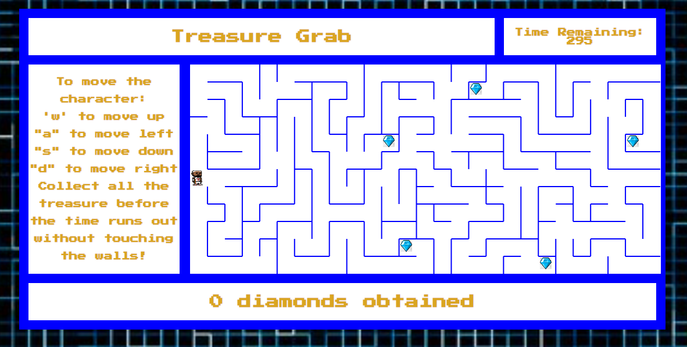

# Treasure Grab


## Description

Treasure Grab is game developed on HTML Canvas with all game functions built with JS. The goal of Treasure Grab is to collect all the treasure before the time runs out without touching the walls of the maze. The image below shows what the game looks like once it is started.




## Blockers During Development

The original idea was to use Canvas built in functions to to draw the lines of the maze. The amount of lines needed to be rendered for the maze reached in addition to the images for the character and diamonds. It caused major issues with loading and rendering of the game. The problem was solved by rendering an image of the completed maze instead of rendering each lines of the maze. It was able to negate the problem altogether.

## Installation

Instructions for local installation:

1. Go to the repository found at: [treasure-grab](https://github.com/tuanhrex/treasure-grab)
2. `fork` the repository.
3. `clone` the repository to the local machine.
```text
git clone https://github.com/tuanhrex/treasure-grab
```
4. Locate and change to the directory
```text
cd .\treasure-grab\
```
5. Open the `index.html` file
```text
open index.html
```


The game can also be played online at : [Treasure Grab] (https://tuanhrex.github.io/)


## How To Play

Once the game is loaded, click on "Start Game" and the timer will appear.

To move the character around the maze:
"w" to move up
"a" to move left
"s" to move down
"d" to move right

When the game is over, you can click on the message to start a new game and time timer will reset.


